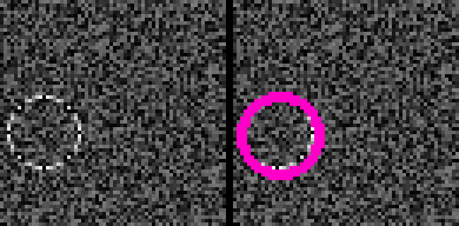
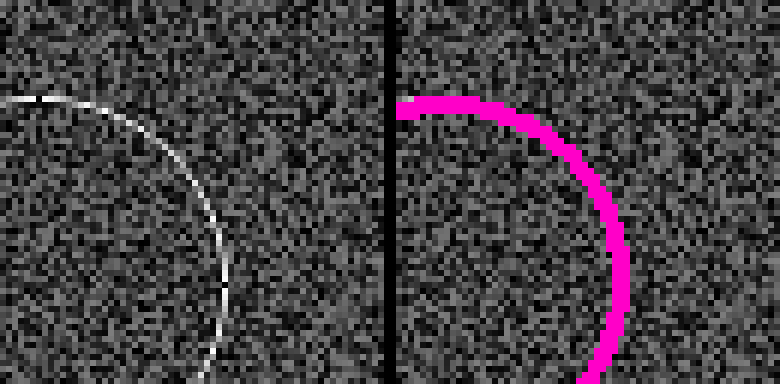
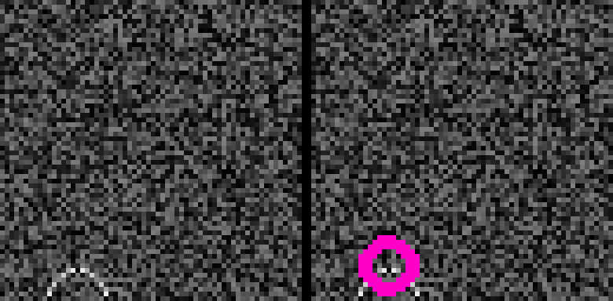
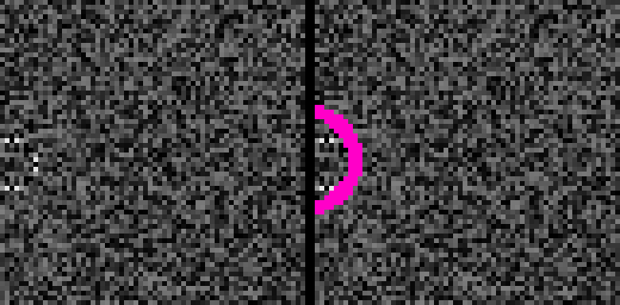

# Circle detection with a CNN

Train a small convolutional network to find a circle on a noisy background. The radius can vary, and the circle may sit partly off the edge of the image.

A CNN is not the only way to do this. The classical computer vision approach is a circular Hough transform. This project is a compact regression demo: synthetic data in, `(row, col, radius)` out.

The original repository used the TensorFlow 1 Estimator API (written against TF 1.13). That stack is gone, so the **same architecture and training objective** now run on TensorFlow 2 / Keras. Weights are not checked in; train them locally (see below).

## Model

Adapted from the [TensorFlow MNIST CNN tutorial](https://github.com/tensorflow/docs/blob/master/site/en/tutorials/estimators/cnn.ipynb), itself a modernization of [LeNet](http://yann.lecun.com/exdb/publis/pdf/lecun-01a.pdf). Input is `64×64` instead of `28×28`. The last layers are a regression head (MSE) rather than class logits.

| Stage | Details |
| --- | --- |
| Input | `64×64×1` float image, brightness in `[0, 1]` |
| Conv + pool | 32 filters, 5×5, same padding, ReLU → 2×2 max-pool |
| Conv + pool | 64 filters, 5×5, same padding, ReLU → 2×2 max-pool |
| Dense | 1024 ReLU, dropout 0.4 while training |
| Output | 3 units: relative `(row, col, radius)` |

Labels use relative image coordinates: the center of a `64×64` image is about `(0.5, 0.5)`. Training data is generated on the fly, so there is no dataset to download and little risk of overfitting.

## Install

Python 3.9+ (3.12 works). From the repo root:

```bash
python -m venv .venv
source .venv/bin/activate   # Windows: .venv\Scripts\activate
pip install -e ".[dev]"
```

Or `pip install -r requirements.txt`. On a CPU-only machine you can install `tensorflow-cpu` instead of `tensorflow`.

For the interactive OpenCV windows, install the GUI extra (headless OpenCV cannot open windows):

```bash
pip install -e ".[gui]"
```

## Quick check (no trained weights needed)

This trains for two optimizer steps on synthetic circles, runs inference, and writes a few overlay PNGs:

```bash
python -m circle_detection smoke
# or
pytest
```

## Train

The original defaults still apply: 8000 SGD steps, batch size 32, learning rate 0.08, noise 0.5. That was about 40 minutes on a desktop CPU in the original write-up; a GPU is much faster.

```bash
python -m circle_detection train
```

Useful knobs:

```bash
python -m circle_detection train --steps 8000 --batch-size 32 --noise 0.5 --learning-rate 0.08
python -m circle_detection train --steps 200 --samples 256 --eval-samples 64 --model-path my_model.keras
```

The model is written to `circle_detection_model.keras` by default. That file is gitignored on purpose — trained weights are large and machine-specific. There is no pretrained download.

`cnn_trainer.py` is still a valid entrypoint and calls the same trainer.

## Inference

After training:

```bash
python -m circle_detection infer --samples 100
python -m circle_detection infer --samples 32 --save-dir inference_output
```

`infer` generates fresh synthetic circles, prints IOU stats, and optionally writes raw + overlay PNGs.

Interactive viewer (needs a display and `pip install -e ".[gui]"`):

```bash
python -m circle_detection view
```

Press `f` / `j` for the next image, `q` or Esc to quit. Without a display the viewer falls back to headless mode and writes overlays to `inference_output/`.

`viewer.py` still works as a script.

## Library usage

```python
import numpy as np
from circle_detection.model import build_model
from circle_detection.infer import load_model, predict_locations
from circle_detection.shapes import noisy_circle

params, image = noisy_circle(size=64, radius=32, noise=0.5)
model = load_model("circle_detection_model.keras")  # or build_model()
row, col, rad = predict_locations(model, image[np.newaxis, ...])[0] * 64
```

## Historical performance

Results from the original TF1 run over 10,000 samples (not reproduced in this port unless you train at the full 8000-step default):

- Average IOU: 0.80
- 93% of samples with IOU > 0.5

Most detections are a close visual match. Large circles that leave the frame are fine. Small circles near the edges are the hard cases, and a complete miss (IOU of 0) is rare but possible.

These examples both have IOU > 0.8 (raw input on the left, predicted circle in pink):





These both have IOU < 0.3:





## Project layout

```
circle_detection/     package (model, data, train, infer, viewer)
cnn_trainer.py        thin wrapper around `python -m circle_detection train`
viewer.py             thin wrapper around `python -m circle_detection view`
tests/                shapes + Keras smoke tests
figures/              example overlays from the original docs
```

## What changed vs the original code

- TensorFlow 1 `tf.estimator`, `tf.layers`, `tf.logging`, and `tf.estimator.inputs.numpy_input_fn` are replaced with Keras (`tf.keras`).
- `np.float` (removed in NumPy 1.24) is now `float32` / `float64`.
- Settings are CLI flags instead of editing source.
- Headless inference works without an X display.
- `pytest` covers data generation, model I/O, and a 2-step smoke train.
