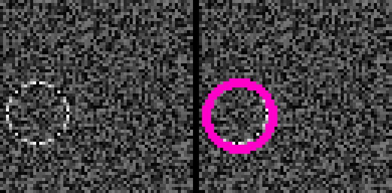
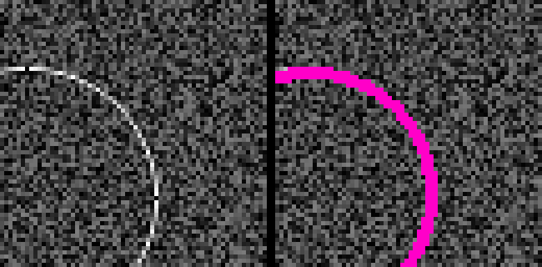
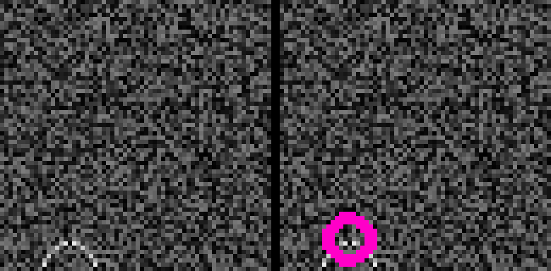
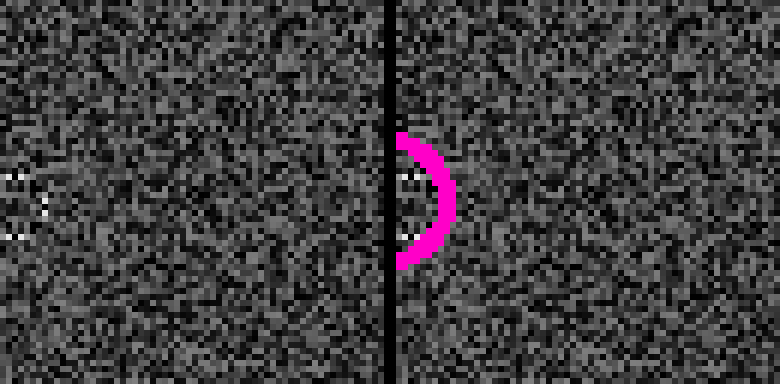

#### Objective
Train a simple convolutional neural network (CNN) to detect circles against a noisy background. The radius can vary, and the circles may be partially off the edge.

A CNN isn't the only way to do this. The classical computer vision approach is with circular Hough transforms.

#### Instructions

* The code is Python 3. Dependencies are TensorFlow, numpy, shapely, scikit-image, and OpenCV (for the visual viewer program).
* TensorFlow compatibility note: There are deprecation warnings. TensorFlow version 2.0 may be an issue; the API moves quickly. I have TensorFlow 1.13.1.

* First, train the model with cnn_trainer.py. The defaults loaded in the program should converge. It takes about 40 minutes using CPU on my top notch desktop. If there's any demand, I'll figure out a place to put the trained model for download.
* The model will be stored ``./circle_detection_model`` by default. Run ``viewer.py`` to generate and view the inference results on a set of samples. Two windows will show, the raw image, and an overlay with the estimated circle drawn in pink.
* Press ``f`` to see the next image, or press ``esc`` to quit the program.

#### Plan
I adapted the [TensorFlow MNIST digit classification demo](https://github.com/tensorflow/docs/blob/master/site/en/tutorials/estimators/cnn.ipynb "TensorFlow MNIST digit classification demo") which, in turn, is a modernization of [LeNet](http://yann.lecun.com/exdb/publis/pdf/lecun-01a.pdf "LeNet"). I expect digit classification to require a richer network than circle detection, so the basic architecture should be sufficient, and I wanted something I could reasonably train on a CPU. I reworked the output layers and loss function to train a detection (regression) objective, and changed the input to be 64x64 instead of 28x28.

It's simple to generate an infinite amount of training and validation data. There's no need for any augmentation or concern about overfitting. Nice! Images are stored as floats, with brightness from 0 to 1. The circle's location and radius is also a float, using relative image coordinates. For example, the image center will be roughly (.5, .5).

It may be possible to use a multistage training approach, starting with low noise, and gradually increasing the noise levels. I wouldn't be surprised to attain superhuman performance with enough tweaking.

#### Performance
Here are results for a run over 10,000 samples.
* Average IOU is .80
* 93% with IOU > .5

Most detections are a close visual match. The raw input is on the left, the predicted circle is displayed in pink. Large circles going well outside the boundaries pose no problem. These both have IOU > .8:

Small circles near the edges cause the most issues. It's also rare, though not impossible, for a detection to miss completely (IOU of 0). These both have IOU < .3:

#### Known limitations

* There's no input UI, edit the Python to change the settings.
* Deprecation warnings, see comment in Instructions.
* Use of Tensorflow's Logging is minimal, the viewer mostly disables it all.
